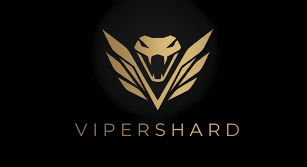

# ViperTab

<p align="center">
  
</p>

A macOS-inspired new tab page for Chrome, Edge, Brave, Opera, and other Chromium-based browsers — glass-themed UI, helpful widgets, an editable dock, and a `/`-key Spotlight that searches the web, your bookmarks, and your open tabs. Part of the ViperShard family.

**[→ Download &amp; install](https://nyfeblade.github.io/ViperTab/)** · [Latest release](https://github.com/ViperShard/ViperTab/releases/latest) · [All versions](https://github.com/ViperShard/ViperTab/releases)

## Features

- **Menu bar** — translucent glass bar with date/time and quick-access buttons.
- **Glass widgets** — clock, weather (Open-Meteo, no API key), notes (auto-saved), calculator, world clocks, and recently closed tabs.
- **Dock** — fully editable. Add, rename, re-icon, and remove your favorite shortcuts.
- **Spotlight** — press `/` (or `⌘/Ctrl + K`, or click the menu-bar magnifier) to search bookmarks, open tabs, and the web.
- **Wallpaper picker** — drop in any image. Defaults to a Sequoia-style sunset gradient.
- **Settings** — `°F`/`°C`, 12h/24h, dock items.

## Install (Load Unpacked)

1. **Download** the latest `.zip` from <https://vipershard.github.io/ViperTab/> (or the [Releases page](https://github.com/ViperShard/ViperTab/releases)).
2. Unzip anywhere.
3. Open `chrome://extensions` (or `edge://extensions`, `brave://extensions`).
4. Toggle **Developer mode** on (top right).
5. Click **Load unpacked** and select the unzipped folder.
6. Open a new tab — ViperTab takes over. ✨

When the weather widget runs for the first time, the browser asks for location access. Allow it for live weather; deny it and the widget just stays blank.

## Auto-updates

ViperTab checks `UPDATE_CHECK_URL` (defined at the top of `script.js`) on every new tab. If the `version` field in that JSON is newer than the installed `manifest.json`, an "Update available" banner appears at the top of the desktop with a download link.

To wire this up:

1. Push this folder to a public GitHub repo (default URL points at `ViperShard/ViperTab`).
2. Update `version.json` at the repo root every time you ship a release — bump `version`, set `url` to the latest `.zip` (Releases page works), put release notes in `notes`.
3. Bump `manifest.json#version` and tag/release.

`UPDATE_CHECK_URL` in `script.js` should point at the *raw* `version.json` URL (e.g. `https://raw.githubusercontent.com/USER/REPO/main/version.json`). Change it in your fork.

**Important caveat:** for installs done via *Load Unpacked* (the only option until you publish to the Chrome Web Store), Chrome will *not* download new code automatically. The banner tells the user to grab a new ZIP — they need to re-load it manually. Once you publish to the Chrome Web Store, real auto-updates kick in.

## Sharing

Until ViperTab is on the Chrome Web Store, the easiest way to share it is:

1. Push this folder to a GitHub repo.
2. Use **Releases** to attach a `.zip` of the folder. Friends download, unzip, and follow the *Load Unpacked* steps above.
3. Or send them a direct link to the repo — `git clone` works too.

A polished one-click install requires publishing to the [Chrome Web Store](https://chrome.google.com/webstore/devconsole) (one-time $5 developer fee, a few-day review). Once published, the share link becomes a single button.

## File layout

```
.
├── manifest.json   # Chrome MV3 manifest
├── newtab.html     # The new-tab page
├── style.css       # Glass UI
├── script.js       # Widgets, dock, spotlight, settings
├── icons/
│   ├── vipershard-logo.png   # master logo asset
│   ├── favicon.png           # 32×32 browser-tab icon
│   ├── icon16.png            # toolbar icon
│   ├── icon48.png            # extensions page icon
│   └── icon128.png           # store / install icon
└── README.md
```

## Permissions

| Permission   | Why |
|--------------|-----|
| `tabs`       | Show open tabs in Spotlight, switch to them on click. |
| `bookmarks`  | Search bookmarks from Spotlight. |
| `sessions`   | "Recently Closed" widget + restore. |
| `storage`    | Persist notes, dock layout, wallpaper, preferences. |

No data leaves your browser. Weather queries hit `api.open-meteo.com` (forecast) and `api.bigdatacloud.net` (reverse-geocoding city name) directly from your machine.

## Hotkeys

| Key                | Action |
|--------------------|--------|
| `/`                | Open Spotlight |
| `⌘K` / `Ctrl+K`    | Open Spotlight |
| `Esc`              | Close Spotlight / Settings |
| Number keys, `+ - * /`, `Enter` | Calculator |
